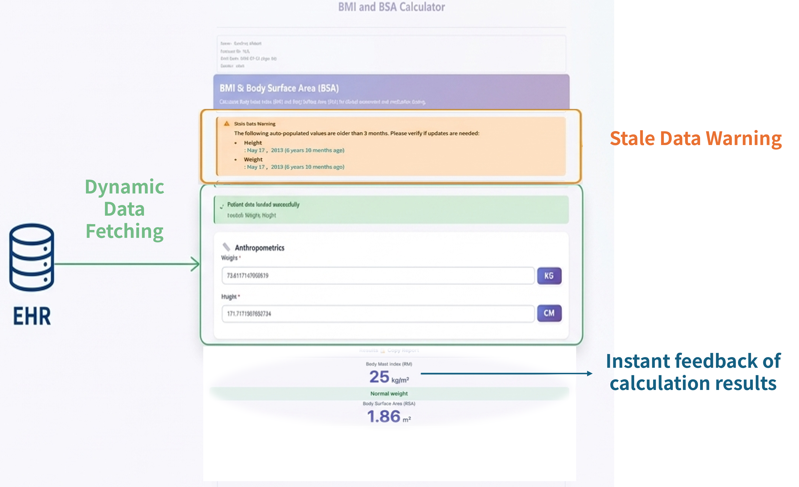

# SMART on FHIR Intelligent Clinical Decision Calculator Platform

[](https://opensource.org/licenses/MIT)
[](https://www.typescriptlang.org/)
[](https://www.hl7.org/fhir/resourcelist.html)
[]()

Engineered to streamline clinical diagnostic workflows, this platform integrates HL7 FHIR R4 standards and Taiwan Core Implementation Guide (TW Core IG) with a modular calculation engine to provide real-time clinical decision support (CDS). By leveraging SMART on FHIR protocols and OAuth 2.0, it automates patient data retrieval for over 92 standardized clinical calculators across 14 specialties, effectively eliminating manual entry errors and transcription risks.

## Project Overview
In contemporary medical practice, clinical risk assessment often relies on independent tools that require clinicians to manually extract and input values from Electronic Health Records (EHR). This process is not only administratively burdensome but also highly susceptible to transcription errors. Furthermore, inconsistent data formats across different medical institutions hinder the development of universal clinical tools.

This platform addresses these challenges by implementing a standardized FHIR-based architecture. By embedding calculators as apps within the hospital's EHR system, the system actively retrieves patient demographics, laboratory results, and vitals using the patient ID in context. This "Zero-Entry" experience ensures data integrity and allows healthcare providers to focus on clinical judgment rather than manual data processing.


### Introduction Video
<p align="center">
  <a href="https://youtu.be/NlIZ0fhsojc">
    
  </a>
</p>


### Key Features

* **Intelligent Auto-Fill (90%+ Automation):** Utilizes authorized FHIR R4 APIs to map clinical data. Empirical tests show the system can automatically complete over 90% of required data fields, minimizing human intervention.
* **Configuration-Driven Factory Model:** Implements a modular architecture where clinical logic (TypeScript-based) is decoupled from the UI, allowing for rapid scaling to 92+ tools while maintaining interface consistency.
* **TW Core IG Integration:** Fully adapted to the Taiwan Core Profiles, ensuring seamless data interoperability within the local medical ecosystem.
* **Multi-dimensional Decision Analysis:** Provides visual "Trade-off Analysis" reports for complex cases, assisting medical teams in making data-driven clinical decisions.
* **Advanced Safety & Verification:** Features a Data Staleness Check to ensure the validity of clinical parameters and adheres to Software as a Medical Device (SaMD) verification protocols.

## Technical Architecture

The system is designed with a three-tier architecture to ensure logic accuracy and data security:
1.  **Foundation Layer**: Manages FHIR OAuth2 authorization, data fetching, and unit conversions.
2.  **Factory Core**: Features the `UnifiedFormulaFactory` and `ScoringFactory` which parse clinical blueprints into executable logic.
3.  **Application Layer**: A responsive UI built with TypeScript and CSS variables, supporting Point-of-Care usage on mobile and desktop.

<p align="center">
  
</p>

### Directory Structure
```text
├── src/
│   ├── calculators/      # Speciality-specific configurations (JSON & Logic)
│   ├── shared/           # Core Engines (Unified Formula & Scoring Factories)
│   ├── fhir-data-service.ts # SMART on FHIR & OAuth 2.0 integration logic
│   └── validator.ts      # Clinical range & Data staleness validation
├── docs/
│   ├── compliance/       # SaMD documents (SRS, Risk Management, etc.)
│   └── ARCHITECTURE.md   # Detailed technical design of the Factory Pattern
├── text/                 # Verification protocols and Test Reports
├── fig/                  # UI screenshots and architectural diagrams
└── nginx.conf            # Security Proxy and CSP configurations
```

### Outcomes
* Validated Feasibility: Successfully demonstrated high automation rates in clinical settings.
* Safety Enhancement: Eliminated transcription risks and improved trend assessment via intuitive visualizations.
* Interoperability: Proven the value of cross-system data integration in clinical decision support.
### Future Work
* AI Integration: Transitioning from static calculations to dynamic risk warnings using AI predictive models.
* Ecosystem Expansion: Promoting standardized templates across different hospital systems to create a shared ecosystem of clinical calculators.
* Personalized Logic: Developing custom calculation functions to adapt to specific clinical scenarios.
### Credits & License
* Development: Justine Huang, Rian Chen, and Chang Gung Memorial Hospital (CGMH)
* Technical Standards: HL7 FHIR Standard, TW Core IG, LOINC Codes
* License: MIT License

## Getting Started
**Launch URL**: [https://justine11289.github.io/SMART-on-FHIR-Intelligent-Clinical-Decision-Calculator-Platform/launch](https://justine11289.github.io/SMART-on-FHIR-Intelligent-Clinical-Decision-Calculator-Platform/launch)

**Docker Deployment**
```bash
git clone [https://github.com/justine11289/SMART-on-FHIR-Intelligent-Clinical-Decision-Calculator-Platform.git](https://github.com/justine11289/SMART-on-FHIR-Intelligent-Clinical-Decision-Calculator-Platform.git)
cd SMART-on-FHIR-Intelligent-Clinical-Decision-Calculator-Platform
npm install
npm run build:ts  # Transpile TypeScript
npm start         # Launch local development server
docker compose up -d --build
```

